<p align="center">
  
</p>

<h1 align="center">Vaillant RAG</h1>

> Named after **Vaillant**, the homing pigeon that flew the last message out
> of Fort Vaux through the shellfire of Verdun in 1916 — and delivered it.
> That is retrieval under pressure: one messenger, the right message,
> against all the noise. This project does the same for your documents.

Retrieval-Augmented Generation (RAG) over your local documents, with **any
OpenAI-compatible LLM endpoint** — Ollama, LM Studio, vLLM, llama.cpp server,
OpenAI, Mistral, and more.

Point it at a folder of documents (PDF, Markdown, plain text, HTML), build a
local vector index, and ask questions answered strictly from your documents'
content — fully offline if you use a local model.

<p align="center">
  
</p>

## Why

Most RAG examples are tied to a single provider SDK or a heavyweight
framework. `vaillant-rag` is a small, readable, dependency-light pipeline that:

- works with **any chat endpoint** speaking the OpenAI `/chat/completions` API;
- runs **fully local** (local embeddings + Ollama) with zero API cost;
- uses **hybrid retrieval** (dense embeddings + BM25, reciprocal rank fusion)
  for noticeably better results than dense-only search;
- supports **incremental indexing**: only changed documents are re-embedded.

## Features

- **Multi-format ingestion**: `.pdf` (PyMuPDF, optional OCR of embedded
  images), `.txt`, `.md`, `.rst`, `.html`
- **Sentence-aware chunking** with configurable size and overlap
- **Hybrid search**: cosine similarity + BM25, fused with RRF
- **FAISS backend** (optional): approximate HNSW search for large
  collections; auto-selected above a configurable size threshold
- **Cross-encoder re-ranking** (optional): re-scores retrieval candidates
  for higher precision before they reach the LLM
- **Streaming answers**: tokens appear as the model generates them, in the
  CLI and over the API (Server-Sent Events)
- **FastAPI web service**: `/ask`, `/ask/stream`, `/reindex`, `/health` —
  multi-user ready with a shared pipeline instance
- **Incremental sync**: SHA-256 content hashing per document; deleted files
  are removed from the index
- **Provider-agnostic LLM client**: one `LLM_BASE_URL` away from switching
  between local and hosted models
- **Interactive Q&A CLI** and single-document analysis mode

## Architecture

```
documents (.pdf/.txt/.md/.html)
        │  loaders.py (extraction, optional OCR)
        ▼
   chunking.py (sentence-aware, size/overlap from config)
        │
        ▼
  embeddings.py (sentence-transformers, E5 prefixes handled)
        │
        ▼
 vector_store.py (numpy index + JSONL text store on disk)
        │
        ▼                            ┌──────────────────────────┐
  retrieval.py  ◄──── question ──────┤ pipeline.py (RAG)        │
  dense (numpy or FAISS) + BM25      │  ▲ cli.py    ▲ api.py    │
        │  RRF fusion, top-k         │  (terminal)  (FastAPI)   │
        ▼                            └────────────┬─────────────┘
  rerank.py (optional cross-encoder, top-n)       │
        │                                         ▼
        └──────────► llm.py — any OpenAI-compatible endpoint
                     (blocking or streamed via SSE)
```

## Quick start

### 1. Install

Requires Python ≥ 3.10.

```bash
git clone https://github.com/<you>/vaillant-rag.git
cd vaillant-rag
python -m venv .venv
# Windows: .venv\Scripts\activate    Linux/macOS: source .venv/bin/activate
pip install -e .
```

Optional OCR support for image-only PDFs (also requires a
[Tesseract](https://github.com/tesseract-ocr/tesseract) install):

```bash
pip install -e ".[ocr]"
```

### 2. Point at an LLM

Any OpenAI-compatible endpoint works. For a free, fully local setup with
[Ollama](https://ollama.com):

```bash
ollama pull phi4-mini
```

Copy the environment template and adjust if needed:

```bash
cp .env.example .env
```

```env
LLM_BASE_URL=http://localhost:11434/v1   # Ollama default
LLM_MODEL=phi4-mini
LLM_API_KEY=                             # only needed for hosted providers
```

Switching to OpenAI, Mistral, vLLM, LM Studio… is just a different
`LLM_BASE_URL` / `LLM_MODEL` / `LLM_API_KEY`.

### 3. Add documents and build the index

```bash
# put your files in data/docs/ then:
vaillant-rag index
```

### 4. Ask questions

```bash
vaillant-rag qa
```

```
Your question: What does chapter 3 say about pricing?

=== Answer (4.2s) ===
...
```

Other commands:

```bash
vaillant-rag update            # incremental re-index (only changed files)
vaillant-rag analyze file.pdf  # run the system prompt against one document
vaillant-rag --config other.yaml qa
```

## Web API

Install the API extra and start the server:

```bash
pip install -e ".[api]"
vaillant-rag serve --host 127.0.0.1 --port 8000
```

Endpoints (interactive docs at `http://127.0.0.1:8000/docs`):

| Method | Path | Description |
|---|---|---|
| `GET` | `/health` | Liveness + index stats |
| `POST` | `/ask` | `{"question": "..."}` → answer + source contexts |
| `POST` | `/ask/stream` | Same, streamed as Server-Sent Events |
| `POST` | `/reindex` | `{"full_rebuild": false}` → sync index with docs dir |

```bash
curl -X POST http://127.0.0.1:8000/ask \
  -H "Content-Type: application/json" \
  -d '{"question": "What does chapter 3 say about pricing?"}'
```

The SSE stream emits one `data: {"contexts": [...]}` event, then
`data: {"delta": "..."}` events per token group, then `data: [DONE]`.

## Scaling retrieval

Two opt-in features improve quality and speed as your corpus grows:

**FAISS (speed, large collections).** Exact numpy search is fine up to
~10⁵ chunks. Beyond that:

```bash
pip install -e ".[faiss]"
```

With `vector_backend: auto` (default), FAISS HNSW kicks in automatically
once the collection exceeds `faiss_min_chunks` (50 000). Force it with
`vector_backend: faiss`.

**Cross-encoder re-ranking (quality).** Set `use_reranker: true` to
re-score the `top_k` candidates with a cross-encoder before selecting the
final `top_n_contexts`. Slower per query, noticeably better precision.
Default model is English (`cross-encoder/ms-marco-MiniLM-L6-v2`); for
multilingual corpora use `reranker_model: BAAI/bge-reranker-base`.

## Configuration

All tunables live in [`config.yaml`](config.yaml); every key can be
overridden by an environment variable of the same name in upper case
(`CHUNK_SIZE_CHARS=800`). Secrets belong in `.env` only.

| Key | Default | Description |
|---|---|---|
| `docs_dir` | `data/docs` | Source documents folder |
| `index_dir` | `data/index` | Generated index (gitignored) |
| `llm_base_url` | `http://localhost:11434/v1` | OpenAI-compatible API root |
| `llm_model` | `phi4-mini` | Model name at the endpoint |
| `llm_temperature` | `0.2` | Sampling temperature |
| `embedding_model` | `intfloat/multilingual-e5-small` | sentence-transformers model |
| `chunk_size_chars` | `1000` | Max chunk length |
| `chunk_overlap_chars` | `150` | Overlap between chunks |
| `top_k` | `20` | Retrieval candidates |
| `top_n_contexts` | `5` | Contexts sent to the LLM |
| `use_hybrid_search` | `true` | Dense + BM25 fusion |
| `vector_backend` | `auto` | `auto` / `numpy` / `faiss` |
| `faiss_min_chunks` | `50000` | Auto-switch threshold for FAISS |
| `use_reranker` | `false` | Cross-encoder re-ranking |
| `reranker_model` | `cross-encoder/ms-marco-MiniLM-L6-v2` | Re-ranking model |
| `ocr_images` | `false` | OCR images inside PDFs |
| `system_prompt_path` | `prompts/system_prompt.txt` | System prompt file (or inline text) |

Customize the assistant's behavior by editing
[`prompts/system_prompt.txt`](prompts/system_prompt.txt).

## Development

```bash
pip install -e ".[dev]"
pytest            # offline test suite (embeddings faked, LLM mocked)
ruff check .      # lint
ruff format .     # format
```

CI (GitHub Actions) runs linting and the test suite on every push and PR.

## Scalability notes

- Default search is exact (numpy + BM25) — ideal up to ~10⁵ chunks; the
  FAISS backend covers larger collections (see *Scaling retrieval*).
- The API serves concurrent users from one shared pipeline; requests run
  in the server thread pool and re-indexing is serialized with a lock.
- BM25 and the FAISS index are rebuilt in memory at startup/reload; for
  very large corpora persist them separately or move to a vector database.

## Security notes

- No secrets are stored in the repository; `.env` is gitignored. Use
  `.env.example` as a template.
- Retrieved document text is sent verbatim to the LLM: treat untrusted
  documents as potential prompt-injection vectors and review answers
  accordingly.

## License

[MIT](LICENSE)
